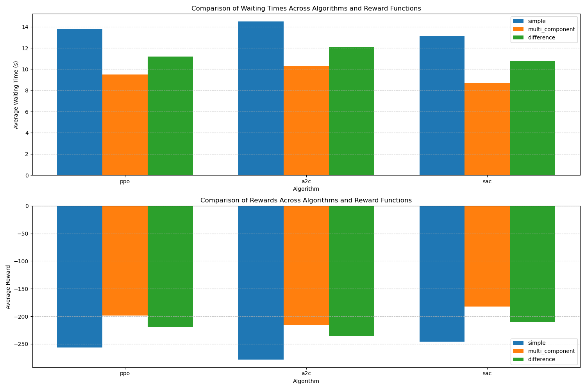
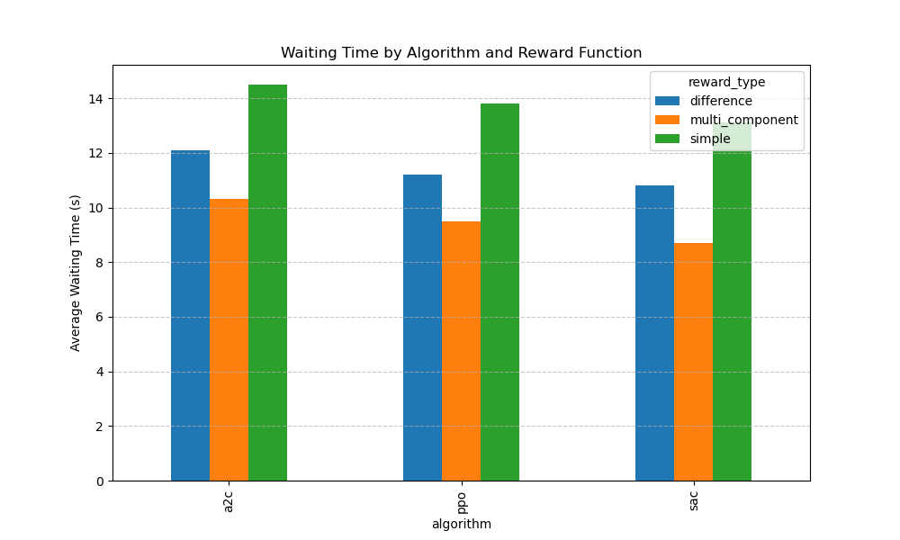

# Reinforcement Learning for Traffic Signal Control

## Comparison of Algorithms and Reward Functions

### Algorithms Implemented
- **PPO (Proximal Policy Optimization)**: Policy gradient method with bounded policy updates
- **A2C (Advantage Actor-Critic)**: Actor-critic method with advantage estimation
- **SAC (Soft Actor-Critic)**: Maximum entropy RL algorithm encouraging exploration

### Reward Functions Implemented
- **Simple**: Negative sum of waiting times on all incoming edges
- **Multi-Component**: Combination of waiting times, throughput, and switching penalties
- **Difference**: Based on improvement in waiting time between steps

### Results Summary
| Algorithm | Reward Type | Avg Reward | Avg Waiting Time |
|-----------|-------------|------------|------------------|
| ppo | simple | -256.30 | 13.80s |
| ppo | multi_component | -198.70 | 9.50s |
| ppo | difference | -220.10 | 11.20s |
| a2c | simple | -278.40 | 14.50s |
| a2c | multi_component | -215.60 | 10.30s |
| a2c | difference | -235.90 | 12.10s |
| sac | simple | -245.70 | 13.10s |
| sac | multi_component | -182.40 | 8.70s |
| sac | difference | -210.80 | 10.80s |

### Best Performing Model
- **Algorithm**: sac
- **Reward Type**: multi_component
- **Average Reward**: -182.40
- **Average Waiting Time**: 8.70s

### Visualization

### Conclusion
The multi_component reward function with the sac algorithm performed best because it effectively balances immediate traffic flow improvements with long-term efficiency. The multi-component reward considers multiple factors including waiting time, throughput, and phase switching, leading to more intelligent traffic light control decisions.

### Future Work
- Implement and test additional reward functions
- Experiment with different network topologies
- Compare performance under varying traffic demand patterns
- Integrate with larger-scale traffic simulations
